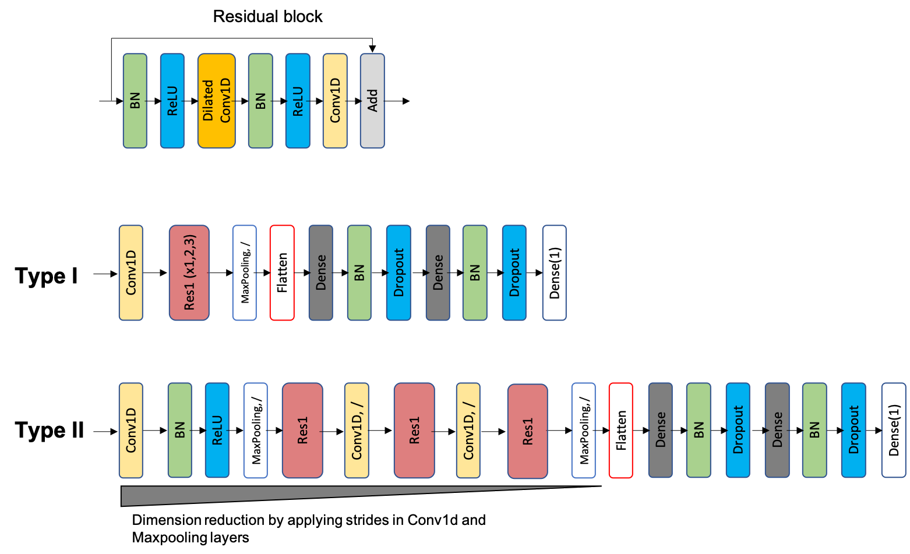

#### Description
`models/` contains two types of model architectures tested and corresponding hyper-param space searched in this study.  


`my_callbacks.py`: defined callbacks used in this part.   
`Preprocessing.py`: some helper functions
`randomopt.py`: the main script for the hyper-param optimization with a random search approach


#### Do optimization
```
python randomopt.py \
--trainfile ../data/ogt_for_hyperopt_original_distribution.fasta \
--modelname Model_ResNetN3.py \
--iterations 1000 \
--patience 100 \
--outdir ../results/opt_hyperparams/ResNetN3_OriDist/
```

```
python randomopt.py \
--trainfile ../data/ogt_for_hyperopt_uniform_distribution.fasta \
--modelname Model_ResNetN3.py \
--iterations 1000 \
--outdir ../results/opt_hyperparams/ResNetN3_UniDist/
```

```
python randomopt.py \
--trainfile ../data/ogt_for_hyperopt_original_distribution.fasta \
--modelname Model_ResNetRed.py \
--iterations 1000 \
--patience 100 \
--outdir ../results/opt_hyperparams/ResNetRed_OriDist/
```

```
python randomopt.py \
--trainfile ../data/ogt_for_hyperopt_uniform_distribution.fasta \
--modelname Model_ResNetRed.py \
--iterations 1000 \
--outdir ../results/opt_hyperparams/ResNetRed_UniDist/

```

#### Analyze optimized results
`visualization.ipynb`